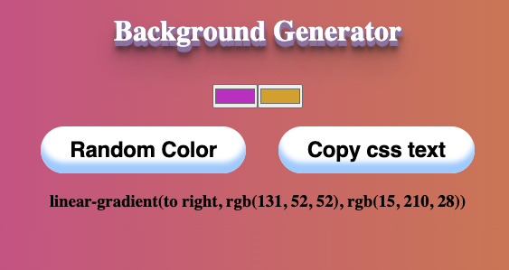

# Background Generator:

[Live Link](https://dveytsman.github.io/vanilla-background)

- A quick little app that allows a user to create a background color gradient manually or randomly.
- The app might be extended with more functionality later (different gradient types, gradient directions ...)

## Usage

### To Manually select a color

- Click on the color picker inputs and the respective colors you'd like as part of your gradient.
- Once you have chosen your colors, the background will change and the text beneath the buttons will display the css style text to copy this particular background.
- To automatically copy the text to the clipboard, click the copy css text button

### To view a randomly generated background

- click on the randomize button.
- the copy functionality is the same as above.
